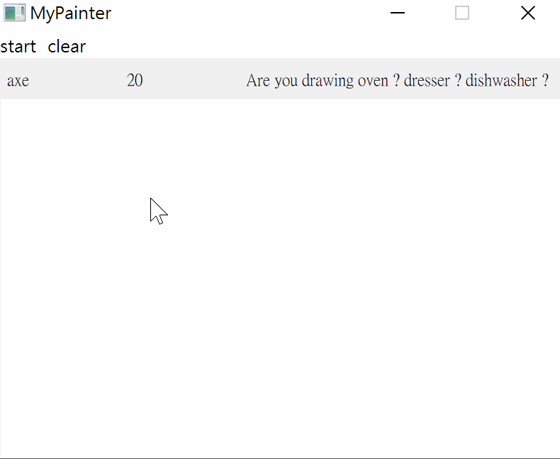
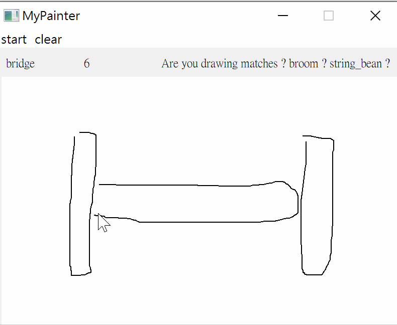
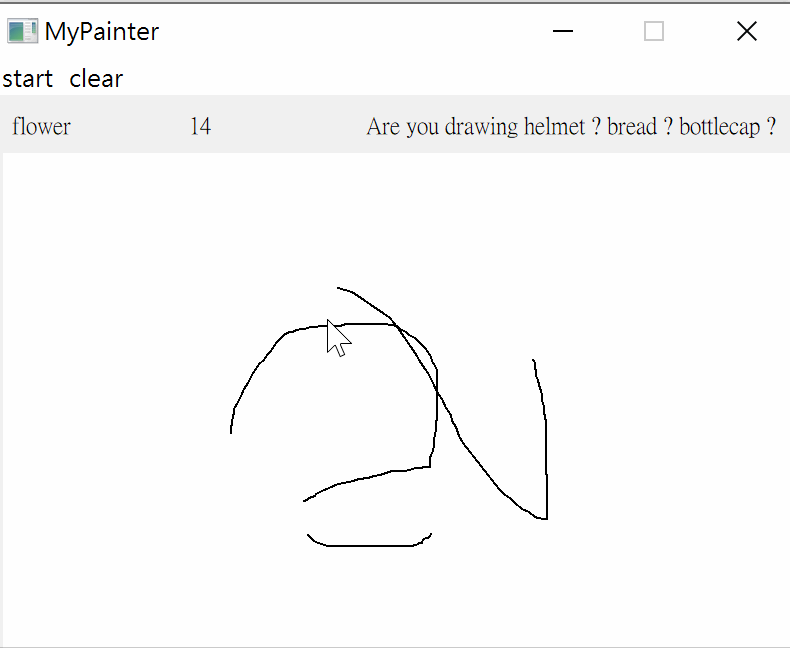

# doodle-recognition-pytorch
quick draw! 
data is from Kaggle **Quick, Draw! Doodle Recognition Challenge**

## Code
gui.py is the main file, use pretrained_weight to inference.

doodle-recognition.py is for training,

## run
```commandline
python gui.py
```

## screen gif





